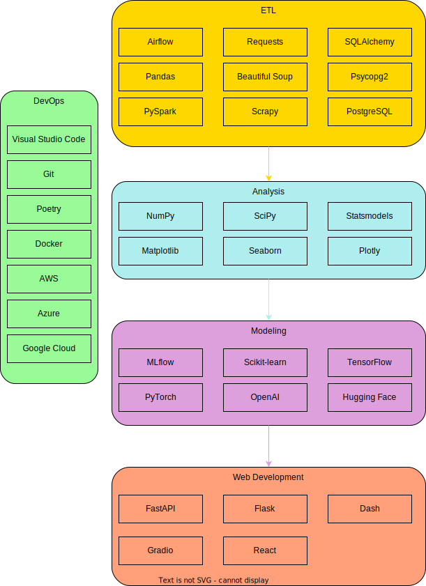

# Data Science Stack

The purpose of this repository is to document the different tools used for various data science activities. These activities include ETL, data visualization, statistics, machine learning, and deep learning. Python is primarily used for most tasks.

## Tools and Technologies

### DevOps

#### IDE
- **[Visual Studio Code](https://code.visualstudio.com/docs)**: A lightweight but powerful source code editor that supports various programming languages and frameworks. Features include debugging, syntax highlighting, intelligent code completion, snippets, and code refactoring.

#### Version Control
- **[Git](https://git-scm.com/doc)**: A distributed version control system for tracking changes in source code during software development. It supports branching, merging, and collaboration through repositories.

#### Dependency Management
- **[Poetry](https://python-poetry.org/docs/)**: A tool for dependency management and packaging in Python. It provides a comprehensive way to manage project dependencies, build packages, and publish them to PyPI.

#### Containerization
- **[Docker](https://docs.docker.com/)**: A platform for developing, shipping, and running applications inside containers. It enables consistent environments across multiple development and production stages.

#### Cloud Providers
- **[AWS](https://aws.amazon.com/machine-learning/)**: Amazon Web Services offers a range of services for developing and deploying machine learning models, including SageMaker for building, training, and deploying models, and Lambda for serverless computing.
- **[Azure](https://azure.microsoft.com/en-us/services/machine-learning/)**: Microsoft Azure provides services such as Azure Machine Learning for building and deploying models, and Azure Functions for serverless computing.
- **[Google Cloud](https://cloud.google.com/products/ai)**: Google Cloud offers AI and machine learning services like AI Platform for building and deploying models, and Cloud Functions for serverless computing.

### ETL

#### Orchestration Framework
- **[Airflow](https://airflow.apache.org/docs/)**: A platform to programmatically author, schedule, and monitor workflows. It uses Directed Acyclic Graphs (DAGs) to manage task dependencies and execution order.

#### Working with Databases
- **[SQLAlchemy](https://www.sqlalchemy.org/)**: A SQL toolkit and Object-Relational Mapping (ORM) library for Python.
- **[Psycopg2](https://www.psycopg.org/docs/)**: A PostgreSQL adapter for Python.
- **[PostgreSQL](https://www.postgresql.org/docs/)**: An open-source relational database management system (RDBMS) known for its robustness, extensibility, and SQL compliance. It supports advanced data types and performance optimization features.

#### Working with APIs
- **[Requests](https://docs.python-requests.org/en/latest/)**: A simple HTTP library for Python, ideal for making API calls.

#### Web Scraping
- **[Beautiful Soup](https://www.crummy.com/software/BeautifulSoup/bs4/doc/)**: A library for parsing HTML and XML documents.
- **[Scrapy](https://docs.scrapy.org/en/latest/)**: An open-source and collaborative web crawling framework for Python.

#### Transform with Python
- **[Pandas](https://pandas.pydata.org/docs/)**: A powerful Python library for data manipulation and analysis. It provides data structures like DataFrames to efficiently handle structured data.
- **[PySpark](https://spark.apache.org/docs/latest/api/python/)**: The Python API for Apache Spark, enabling large-scale data processing and analytics. It supports reading from various file formats including CSV, JSON, Parquet, and more, and provides a high-level API for distributed data processing.

### Data Visualization
- **[Matplotlib](https://matplotlib.org/stable/contents.html)**: A comprehensive library for creating static, animated, and interactive visualizations in Python.
- **[Seaborn](https://seaborn.pydata.org/)**: A statistical data visualization library based on Matplotlib, providing a high-level interface for drawing attractive and informative statistical graphics.
- **[Plotly](https://plotly.com/python/)**: A graphing library that makes interactive, publication-quality graphs online.

### Statistics
- **[NumPy](https://numpy.org/doc/stable/)**: A fundamental package for scientific computing with Python. It provides support for arrays, matrices, and many mathematical functions to operate on these data structures.
- **[Pandas](https://pandas.pydata.org/docs/)**: A powerful Python library for data manipulation and analysis. It provides data structures like DataFrames to efficiently handle structured data and perform statistical operations.
- **[SciPy](https://docs.scipy.org/doc/scipy/)**: A library used for scientific and technical computing, including modules for optimization, integration, interpolation, eigenvalue problems, and other advanced mathematical functions.
- **[Statsmodels](https://www.statsmodels.org/stable/index.html)**: A library for estimating and testing statistical models, including linear regression, generalized linear models, and time series analysis.

### Machine Learning

#### Orchestration
- **[MLflow](https://mlflow.org/docs/latest/index.html)**: An open-source platform for managing the end-to-end machine learning lifecycle. It includes modules for experiment tracking, model packaging, and deployment.

#### Modeling
- **[Scikit-learn](https://scikit-learn.org/stable/user_guide.html)**: A machine learning library for Python that provides simple and efficient tools for data mining and data analysis. It includes algorithms for classification, regression, clustering, and dimensionality reduction.

### Deep Learning
- **[TensorFlow](https://www.tensorflow.org/learn)**: An end-to-end open-source platform for machine learning. It has a comprehensive, flexible ecosystem of tools, libraries, and community resources for building and deploying machine learning models.
- **[PyTorch](https://pytorch.org/docs/stable/index.html)**: An open-source machine learning library based on the Torch library. It provides a flexible and dynamic interface for building deep learning models.

### Large Language Models (LLMs)
- **[Hugging Face](https://huggingface.co/docs)**: A platform providing tools to build, train, and deploy state-of-the-art machine learning models, particularly in natural language processing (NLP).
- **[OpenAI](https://beta.openai.com/docs/)**: A research organization that provides access to advanced AI models, including the GPT series, for various applications such as text generation, translation, and summarization.

### Web Development

#### API Endpoints for model predictions
- **[FastAPI](https://fastapi.tiangolo.com/)**: A modern, fast (high-performance), web framework for building APIs with Python 3.6+ based on standard Python type hints.

#### Backend for web apps
- **[Flask](https://flask.palletsprojects.com/en/2.0.x/)**: A lightweight WSGI web application framework in Python. It is designed with simplicity and flexibility in mind.
- **[Dash](https://dash.plotly.com/introduction)**: A productive Python framework for building web applications. It is particularly suited for building data visualization apps with highly customizable user interfaces.

#### Chatbot Frontend
- **[Gradio](https://gradio.app/docs/)**: A Python library for creating interactive user interfaces for machine learning models. It is used to build and share web-based demos of models.

#### General Frontend
- **[React](https://reactjs.org/docs/getting-started.html)**: A JavaScript library for building user interfaces. It allows developers to create large web applications that can update and render efficiently in response to data changes.